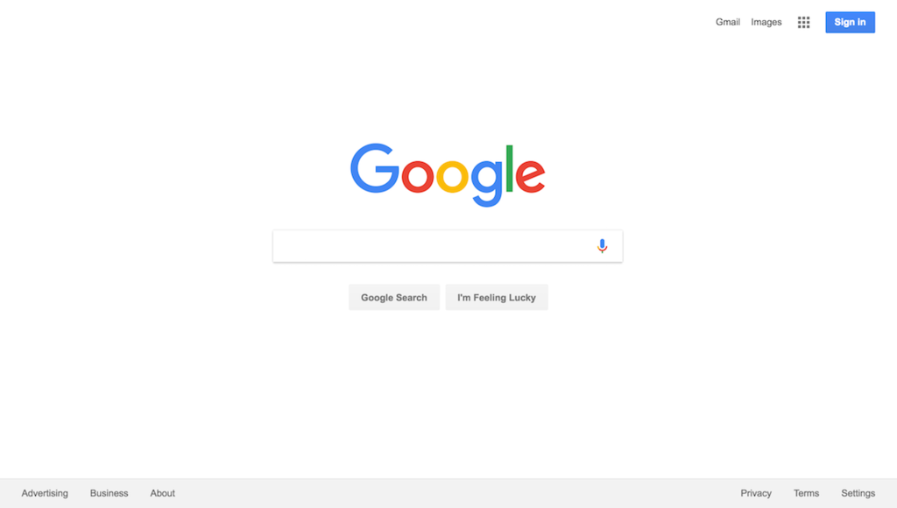

@title[Introduction]
<h2>Biases</h2>

Source: [xkcd](https://xkcd.com/385/)

Felipe Urra

---
<h2>What is bias?</h2>

"Prejudice in favour of or against one thing, person, or group compared with another, usually in a way considered to be unfair."
 ***-Wikipedia***

"Prefering something over another thing"
 ***-Felipe Urra***

---
<h3>Bias</h3>
In terms of culture:

"Biased means one-sided, lacking a neutral viewpoint, or not having an open mind."

There are different types of biases:

* Social biases
* Memory biases
* **Cognitive biases**
---
<h3>Cognitive biases</h3>

"Systematic error in thinking that affects the decisions and judgments that people make."
 ***-www.verywellmind.com***

"A cognitive bias is when you take a bad choice thinking that is a good choice."
 ***-People in the street, probably***

---
<h3>Causes</h3>

Bias can arise from various processes.

Some of them are:

* Heuristics (method not perfect but sufficient)
* Noisy information processing
* Brain's information processing capacity (limited)
* Emotional and moral motivations
* Social influence

---
<h3>Some Examples</h3>

* Confirmation bias
* Anchoring bias
* Pro-innovation bias
* Optimism bias

---
<h3>Confirmation Bias</h3>

Tendency to confirm existing beliefs or preconceptions.

* "This was a bad idea. I knew it; I should have never trusted you"
* "I told you, all computer science students are nerds."

---
<h4>Possible Reason</h4>

Convenience, doesn't challenge ideas.

 
 
"There are no facts, only interpretations"
 ***-Friedrich Nietzsche***

---
<h3>Anchoring Bias</h3>

Tendency to rely too heavily on the first piece of information perceived.

---
<h4>Possible Reason</h4>

Convenience, it's harder to estimate numbers or information you don't know.

Neither should a ship rely on one small anchor, nor should life rest on a single hope. 
 ***-Epictetus***

---
<h3>Optimism Bias</h3>

Tendency to believe that you are at a lesser risk of suffering a negative event compared to others.

* "I don't think I'll get cancer if I smoke."
* "Relax. Your presentation will be well received."

---
<h4>Possible Reason?</h4>

Guess.

---

---
<h3>Why care at all?</h3>

* Allows to know ourselves and understand some limitations of human perception
* To make better and rational decisions
* Understand others' people actions and behaviours

---
<h3>Summary</h3>

* We are all biased.
* There are many cognitive biases and they all affect our decisions
* If we are aware of these biases, we can minimize their effect
* We think we are rational, but we're not fully rational all the time
* Important for understanding ourselves and relate effectively with others

---

"It is the mark of an educated mind to be able to entertain a thought without accepting it."
 ***-Aristotle***

---
<h3>More biases</h3>

[www.businessinsider.com](https://amp.businessinsider.com/images/56a111b8e6183e263a8badf6-1136-2127.png)

---
<h3>References</h3>

[dispatchist.com](https://dispatchist.com/mind-hacks-cognitive-bias/)

[www.sagu.edu](https://www.sagu.edu/thoughthub/the-affects-of-anchoring-bias-on-human-behavior)

[www.quora.com](https://www.quora.com/Why-is-it-important-to-know-about-cognitive-biases)

[www.freemake.com](http://www.freemake.com/blog/20-funny-things-to-ask-google/)

[en.wikipedia.org](https://en.wikipedia.org/wiki/Bias)

[gunshowcomic.com](http://gunshowcomic.com/648)

[en.wikipedia.org](https://en.wikipedia.org/wiki/Google#/media/File:Google_web_search.png)

---
<h3>Questions?</h3>

